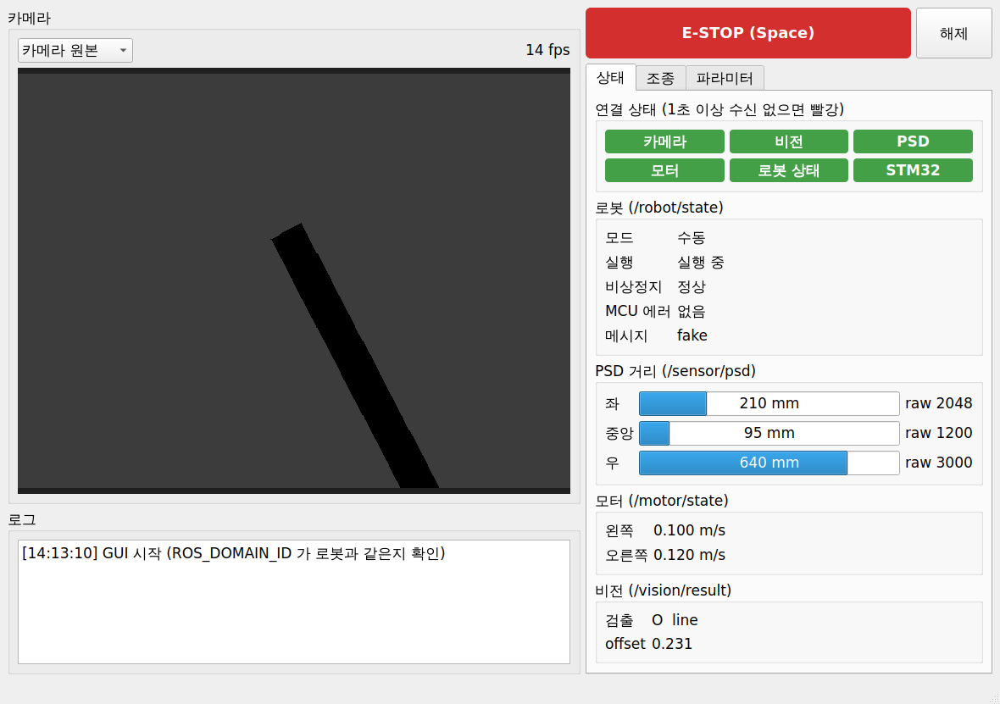

# gui/

노트북에서 실행하는 **Qt GUI** (`turtle_gui` 패키지)입니다. 로봇과는 **ROS 2로만** 통신합니다.



## 빌드 & 실행

```bash
# 레포 루트에서
source /opt/ros/jazzy/setup.bash
bash scripts/build_gui.sh                # turtle_interfaces + turtle_gui 빌드
source install/setup.bash
ros2 run turtle_gui turtle_gui
```

Qt5가 없으면: `sudo apt install qtbase5-dev`

### 로봇 없이 테스트

가짜 로봇 노드가 PSD, 모터, 상태, 비전 결과, 카메라 영상(OpenCV 있을 때)을 발행하고 Start/Stop/E-STOP/모드 서비스에 응답합니다.

```bash
# 터미널 1
source install/setup.bash
ros2 run turtle_gui fake_robot.py

# 터미널 2
source install/setup.bash
ros2 run turtle_gui turtle_gui
```

파라미터 탭에서 [노드 찾기] → `/fake_robot` 선택 → [불러오기]로 파라미터 수정도 시험할 수 있습니다.

## 화면 구성

| 영역 | 내용 |
|---|---|
| 왼쪽 위 | 카메라 영상 (원본 / 영상처리 결과 선택), fps |
| 왼쪽 아래 | 로그 (서비스 응답, 파라미터 적용 결과) |
| 오른쪽 위 | **E-STOP** / 해제 버튼 (키보드 Space = E-STOP) |
| 상태 탭 | 토픽별 연결 램프, 로봇 상태, PSD 3개, 모터 속도, 비전 결과 |
| 조종 탭 | Start/Stop, 수동/자율 모드, W/A/S/D 수동 주행 + 속도 슬라이더 |
| 파라미터 탭 | 노드 선택 → 파라미터 전체 불러오기 → 값 수정(노란색) → 적용 |

- 연결 램프: 회색 = 아직 수신 없음, 초록 = 정상, 빨강 = 1초 이상 끊김
- 수동 주행: 누르고 있는 동안 10 Hz로 `/cmd_vel_manual` 발행, 떼면 정지 명령 1번. 창 밖을 클릭하면 자동으로 멈춤
- 파라미터 탭이 열려 있을 때는 키보드 조종(W/A/S/D, Space)이 꺼집니다 (값 입력과 충돌 방지)

## 코드 구조

```text
gui/turtle_gui/
├── ui/main_window.ui              화면 배치 (Qt Designer로 수정)
├── include/turtle_gui/
│   ├── gui_types.hpp              QNode → 화면으로 넘기는 데이터 구조체
│   ├── qnode.hpp                  ROS 2 통신 전담 (별도 스레드)
│   └── main_window.hpp            화면 표시, 버튼/키 입력
├── src/
│   ├── main.cpp
│   ├── qnode.cpp                  구독/발행/서비스/파라미터 클라이언트
│   └── main_window.cpp
└── scripts/fake_robot.py          로봇 없이 테스트용 가짜 노드
```

`main_window`는 ROS 타입을 모르고, `qnode`와 **signal/slot + gui_types 구조체**로만 연결됩니다.

```text
qnode ── imageReceived, psdReceived, robotStateReceived ... ──▶ main_window (표시)
main_window ── 버튼/키 ──▶ qnode.callRun(), publishManualCmd(), setParameters() ... ──▶ ROS 2
```

## 기능별 ROS 2 대응

| GUI 기능 | ROS 2 |
|---|---|
| 카메라 영상 | `/camera/image_raw/compressed` 또는 `/vision/debug_image/compressed` 구독 (선택한 것만) |
| PSD 값 | `/sensor/psd` |
| 모터 상태 | `/motor/state` |
| 로봇 상태, 모드, STM32 연결 | `/robot/state` |
| 비전 결과 | `/vision/result` |
| Start / Stop | `/robot/run` (`std_srvs/SetBool`) |
| E-STOP / 해제 | `/robot/estop` (`std_srvs/SetBool`) |
| 수동 / 자율 모드 | `/robot/set_mode` (`turtle_interfaces/srv/SetMode`) |
| 수동 주행 | `/cmd_vel_manual` (`geometry_msgs/Twist`) 발행 |
| 파라미터 | `rclcpp::AsyncParametersClient` 로 list / get / set |

모든 구독은 best-effort QoS라서 발행 쪽 QoS와 상관없이 연결됩니다.

## 기능 추가 방법

새 토픽을 표시하려면:

1. `gui_types.hpp`에 구조체 추가 + `Q_DECLARE_METATYPE`
2. `qnode.hpp/cpp`에 구독 + signal 추가, 생성자에서 `qRegisterMetaType`
3. `main_window.ui`에 위젯 추가 (Qt Designer)
4. `main_window.hpp/cpp`에 slot 추가 후 `connect`

GUI 안에 STM32 통신, OpenCV 처리, 제어 로직을 넣지 않습니다.
